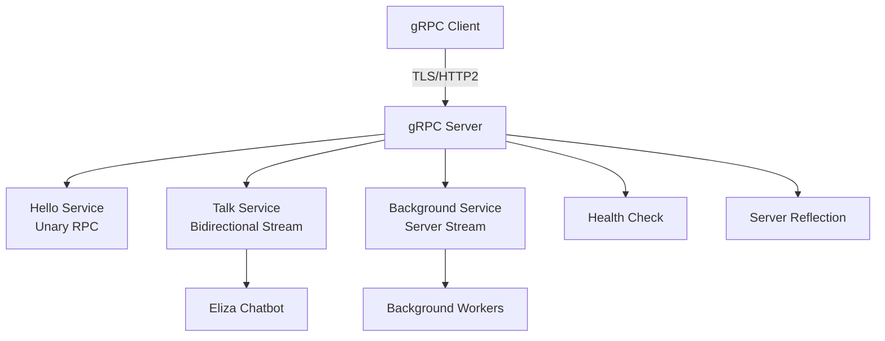

# 🚀 Basic gRPC Service Documentation

Welcome to the **Basic gRPC Service** documentation! This is a modern Python gRPC service that showcases:

- 🔄 **Bidirectional streaming** with real-time chat
- ⚡ **Async/await** everywhere for performance
- 🎭 **Background task orchestration** with live updates
- ☁️ **CloudEvents** integration for event-driven architecture
- 🔐 **TLS/SSL** security with certificates
- 🏥 **Health checks** and **reflection** built-in

## 🎯 Quick Navigation

- :material-rocket-launch: **[Getting Started](getting-started.md)**

    Jump right in with installation and setup instructions

- :material-api: **[API Reference](reference/)**

    Complete documentation of all classes and methods

- :material-play-circle: **[Examples](examples.md)**

    Code examples and usage patterns

- :material-cog: **[Development](development.md)**

    Contributing and development guidelines

## 🌟 Key Features

### Real-time Communication
Our service supports bidirectional streaming, perfect for chat applications and real-time data feeds.

### Background Processing
Demonstrate parallel task execution with the Background method - run multiple tasks and get live progress updates.

### Enterprise Ready
Built with CloudEvents, structured logging, health checks, and graceful shutdown handling.

## 🔧 Architecture

Ready to dive in? Start with our [Getting Started](getting-started.md) guide!
